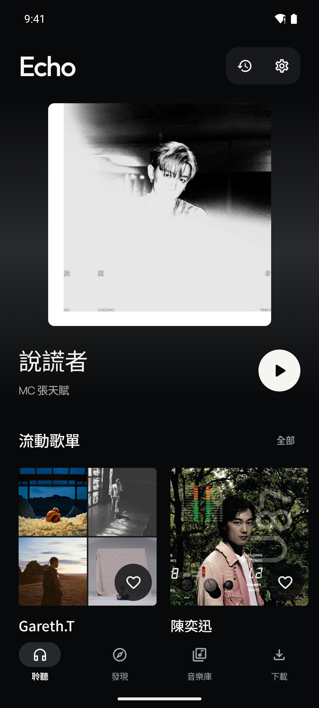
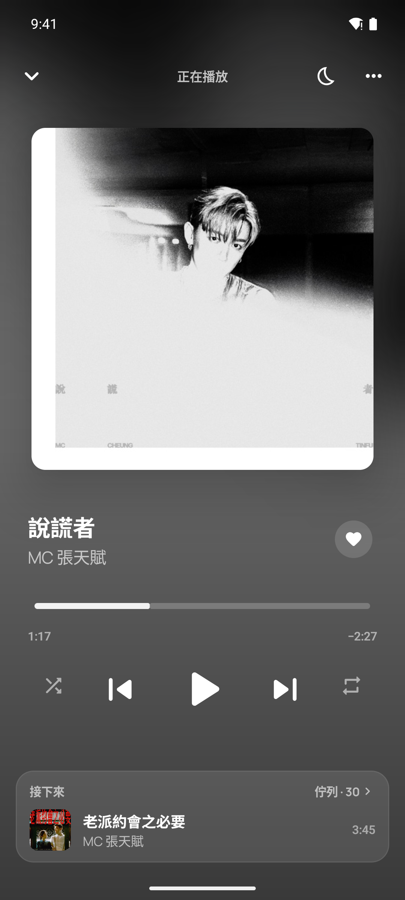
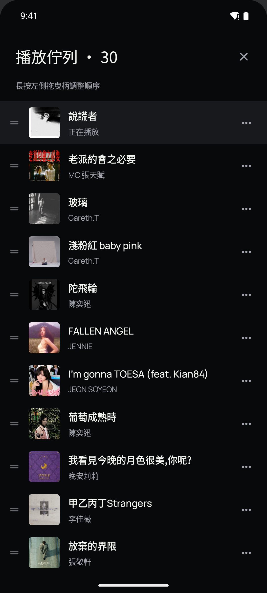
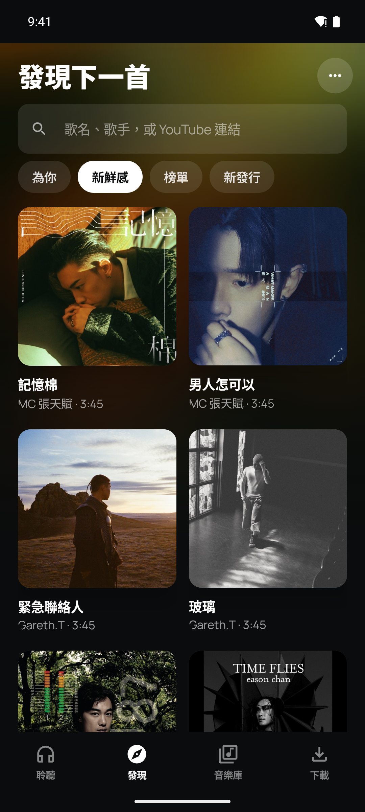
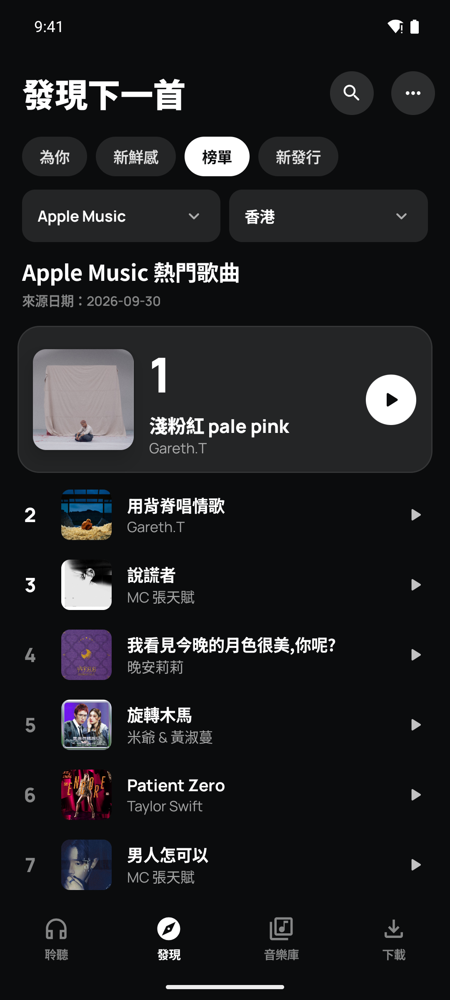
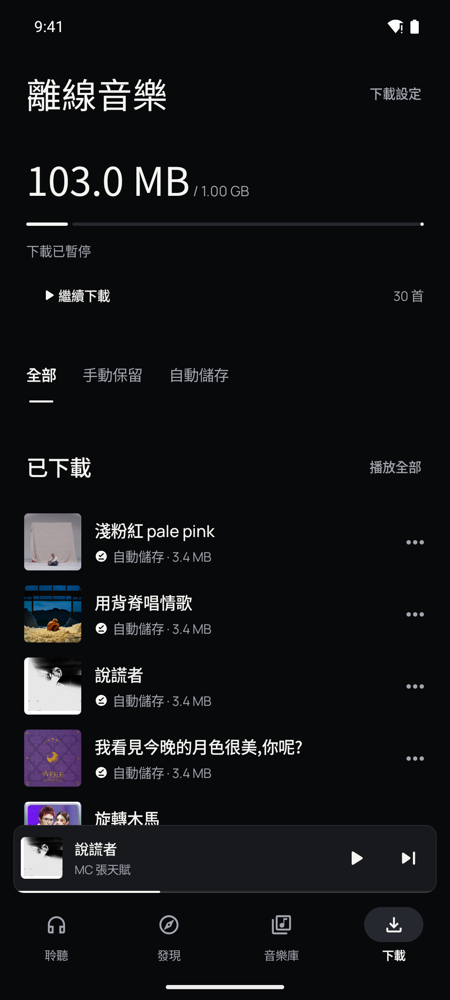
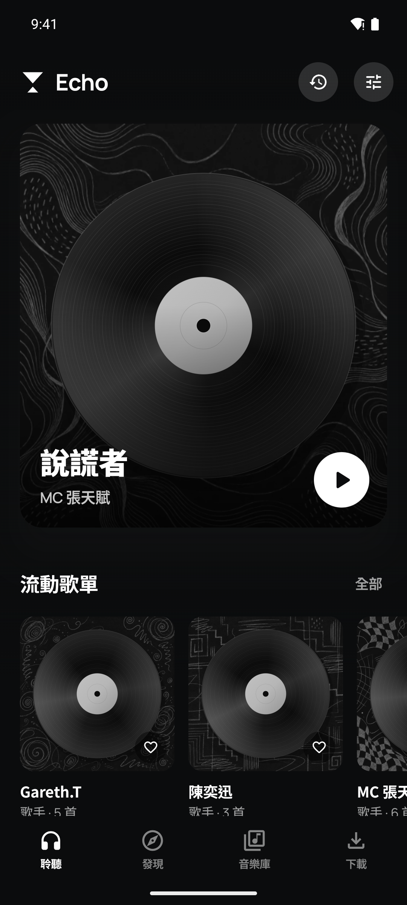

# Echo

[English](docs/README.en.md) · [Android 下載](https://github.com/ab003317/Echo/releases/latest) · [.env 設定](docs/configuration.md) · [AI 渠道設定](docs/ai-providers.md)


Echo 是音樂伺服器與 Android 播放器，支援背景播放、離線保存、每日探索及個人化推薦。

- 背景與鎖定畫面播放、播放佇列、隨機、單曲／清單循環、播放記錄。
- Wi-Fi 自動保存最近聆聽、最常聆聽、最愛及推薦歌曲；可設定容量、手動保留或刪除。
- 預先下載的新歌池：聽過的保留，常聽的進入常駐池，未聽的每日部分輪換。
- 每日產生歌手、系列、曲風及隨機歌單；收藏後固定保留。曲風分類需要實際音訊證據。
- YouTube／Apple Music 地區榜單、Echo 播放排行，以及已關注歌手的新發行。
- AI 依實際聆聽秒數、重播、完成與主動跳過分析；**不以歌名猜測曲風**。
- App 與部署文件提供繁體中文／English。

## App 畫面

Echo 實際畫面，使用示範音樂庫。頁面背景取自目前封面的顏色。點擊圖片可查看完整尺寸。

| 首頁與每日歌單 | 播放器 | 播放佇列 |
| --- | --- | --- |
| [](docs/screenshots/zh-Hant/home.png) | [](docs/screenshots/zh-Hant/player.png) | [](docs/screenshots/zh-Hant/queue.png) |
| 推薦歌曲與每日輪換的歌單集中在首頁；喜歡的歌單可永久保存。 | 調整播放進度、隨機與循環模式，加入最愛或設定睡眠定時；底部預覽下一首，點擊打開佇列。支援背景播放。 | 長按右側拖曳柄調整順序，透過曲目選單移除歌曲；可直接切換隨機與循環。 |

| 發現下一首 | 榜單 | 離線保存 |
| --- | --- | --- |
| [](docs/screenshots/zh-Hant/discover.png) | [](docs/screenshots/zh-Hant/charts.png) | [](docs/screenshots/zh-Hant/downloads.png) |
| 探索已入庫、可即播的歌曲，下拉刷新並向下瀏覽更多內容；另支援 YouTube 搜尋與連結匯入。 | 切換 YouTube、Apple Music 與 Echo 播放排行；「新發行」按已關注歌手的發行日期排列歌曲。 | 查看手機已保存的歌曲與容量；Wi-Fi 自動保存來源及容量上限可在下載設定調整。 |

<details>
<summary>沒有封面的音樂</summary>

缺少封面時，顯示唱片與 20 款黑白 doodle 背景之一；同一首歌的背景保持一致。

[](docs/screenshots/zh-Hant/no-cover.png)

</details>

取歌、排序公式、AI 提示詞及現有限制見[音樂來源、選歌與 AI](docs/recommendation-engine.md)。

每個部署共用一份音樂庫、播放記錄與推薦偏好，沒有獨立使用者帳戶或 App 存取金鑰。能連到伺服器的人均可操作；存取限制由私人網路或反向代理設定。

## 部署

需要 Linux 私人伺服器／NAS、Docker Engine 和 Docker Compose v2。App 需要 Android 8.0 或以上。

**以下 HTTPS 部署須自備可管理 DNS 的網域或子網域。** 沒有網域時，請自行上網搜尋「免費網域申請指南」；本專案不提供網域申請教學。

```bash
git clone https://github.com/ab003317/Echo.git
cd Echo
cp .env.example .env
```

`.env` 是伺服器設定檔，與 `compose.yaml` 放在同一個目錄。用文字編輯器開啟，修改以下項目：

```dotenv
DOMAIN=music.example.com
MUSIC_PATH=/path/to/your/music
AI_API_KEYS='["your-gemini-api-key"]'
```

`DOMAIN` 填已設定的網域，`MUSIC_PATH` 填伺服器上的音樂資料夾路徑，`AI_API_KEYS` 填 AI 渠道簽發的 key。Gemini key 可在 [Google AI Studio](https://aistudio.google.com/apikey) 建立；其他渠道的[申請入口與步驟](docs/ai-providers.md#api-access)見 AI 指南。

每個欄位的用途、預設值、必填條件、取得位置及範例見 [.env 逐項設定](docs/configuration.md)。不使用的可選欄位按指南保留預設或留空。

預設使用 Gemini `gemini-3.8-flash`，同時支援行為與音訊分析。`AI_API_KEYS` 填入有效 API key，無 key 時填 `[]`。音樂庫、播放、離線保存及不依賴 AI 的推薦不需要 API key。AI 渠道會依用量計費或消耗額度。

啟動前，網域 DNS 必須指向伺服器，TCP 80／443 必須可達。內建 Caddy 自動申請 HTTPS 憑證。已有服務佔用 80／443、使用 Tunnel 或只用內網時，請看[其他部署方式](docs/deployment.md)。

```bash
docker compose config --quiet
docker compose up -d --build
docker compose exec echo python -m server.check_config
```

設定檢查會顯示 AI 渠道、模型與 key 數量，不會呼叫 AI 或驗證 key 額度。之後修改 `.env`，使用 `docker compose up -d` 套用。

打開 `https://music.example.com/music`，下載 [Echo APK](https://github.com/ab003317/Echo/releases/latest)。App 首次開啟時填入相同位址；**手機只填伺服器位址，AI key 留在伺服器**。

## AI 設定

`.env.example` 內每項都有繁中與英文註解；[AI 設定指南](docs/ai-providers.md)提供官方渠道、模型、OpenAI 相容 URL、多 key、音訊和 VPN／代理範例。

| 設定 | 用途 |
| --- | --- |
| `AI_PROVIDER` | `gemini`、`openai`、`deepseek`、`qwen`、`custom` 或 `none` |
| `AI_BASE_URL` | API 根位址；不含 `/chat/completions`。自訂渠道與 Qwen 必填 |
| `AI_MODEL` | 模型 ID；留空使用渠道預設 |
| `AI_API_KEYS` | 一組 key，或 `'["key-one","key-two"]'` |
| `AI_PROXY_URL` | 可選的 AI HTTP(S) 代理 |
| `AUDIO_AI_*` | 音訊分析另選渠道、模型、URL 與 key |
| `YOUTUBE_PROXY_URL` | YouTube 的獨立代理 |

是否需要 VPN／代理取決於**伺服器網路、渠道服務地區與帳戶資格**，不是某個模型名稱的固定屬性。請核對[渠道文件與支援地區](docs/ai-providers.md#network)。

AI 預設每日分析前一日聆聽資料，音訊每天最多抽樣 12 首，每首最多 60 秒。音訊會傳往指定渠道；`AUDIO_AI_PROVIDER=none` 可關閉音訊分析。關閉後仍可分析聆聽行為，曲風分類則需要音訊分析結果。

## 資料與維護

音樂目錄是主機掛載；資料庫、收藏、播放記錄、歌單及封面在 Docker `echo_data` volume。
新歌池輪換只清理由 Echo 管理的探索歌曲，保留原有音樂檔案。
YouTube 搜尋／匯入依賴 yt-dlp 與來源可用性，並非 YouTube Music 帳戶同步；只匯入你有權使用的音源。

更新、備份、還原、NAS 權限、既有代理及 cookies 的做法見[部署維護指南](docs/deployment.md)。
專案未指定授權條款。第三方元件保留各自授權，見 [THIRD_PARTY.md](THIRD_PARTY.md)。

## 開發

```bash
python -m venv .venv
. .venv/bin/activate
pip install -r server/requirements.lock
python -m pytest server -q
# 直接執行不會自動讀取 .env；需先設定環境變數。
python -m uvicorn server.app:app --host 127.0.0.1 --port 18082
```

Android 使用 JDK 17 或以上、Android SDK 36：

```bash
cd android
./gradlew :app:testDebugUnitTest :app:lintDebug :app:assembleDebug
```

正式 APK 需要自己的簽署設定，見 [Android 建置說明](docs/android.md)。GitHub CI 執行 Python、Android 與 Docker 檢查；CI debug APK 適合測試，正式下載請使用 Releases。
