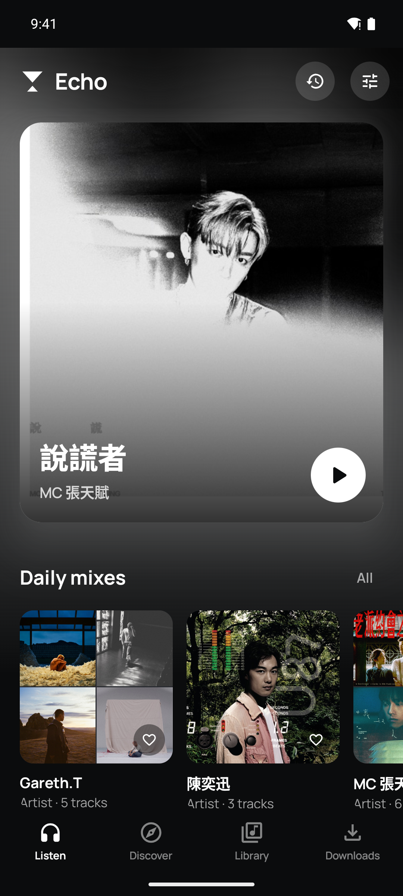
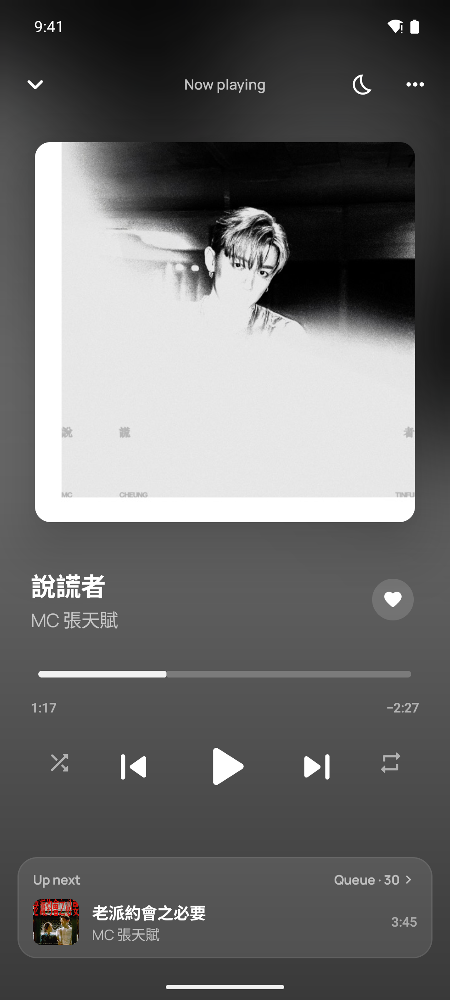
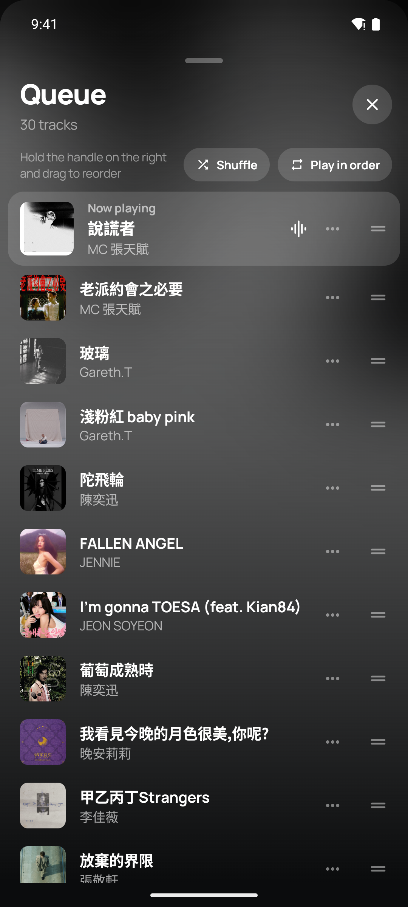
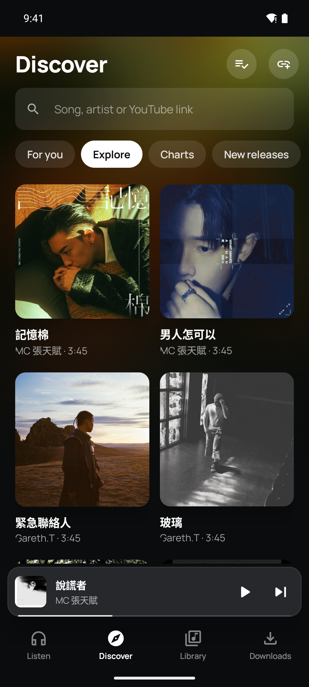
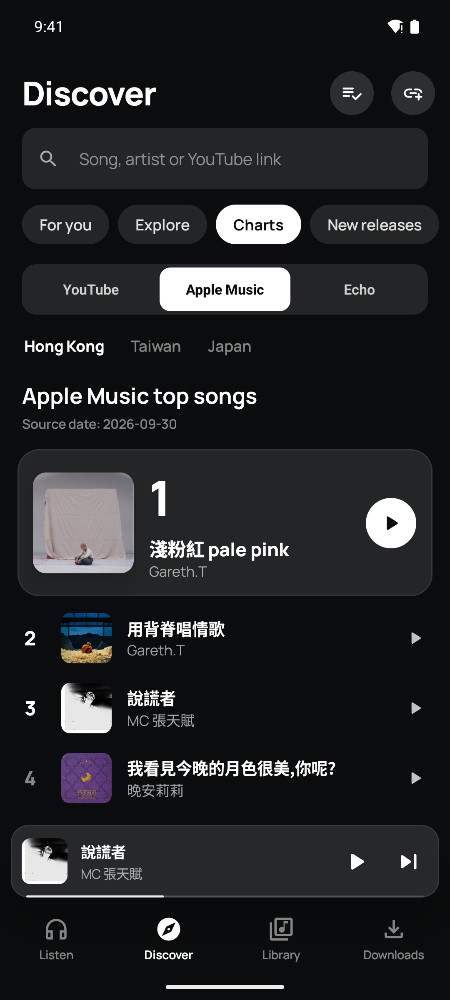
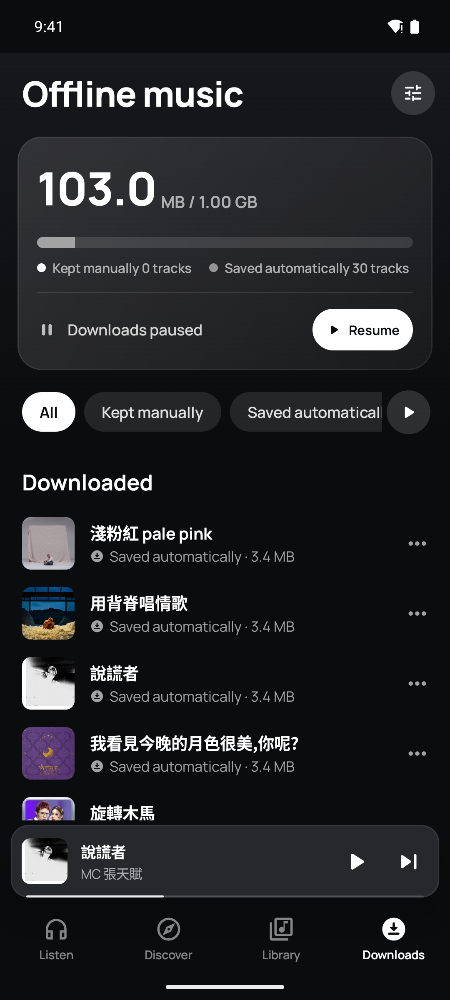
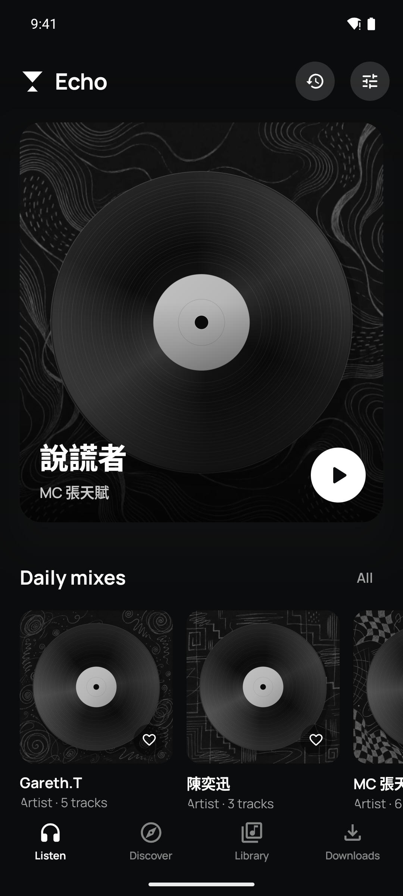

# Echo

[繁體中文](../README.md) · [Download Android](https://github.com/ab003317/Echo/releases/latest) · [.env configuration](configuration.en.md) · [AI providers](ai-providers.md)

Echo is a music server and Android player with background playback, offline music,
daily discovery and recommendations informed by listening behavior.

- Background and lock-screen playback, queue, shuffle, repeat and listening history.
- Automatic Wi-Fi downloads from recent, frequent, favorite and recommended music,
  with a storage budget, manual retention and deletion.
- A prepared discovery pool: heard tracks stay, frequently played tracks become
  permanent, and part of the unheard pool rotates daily.
- Daily artist, series, style and random mixes. Saved mixes are retained.
  Style mixes require actual audio evidence.
- YouTube and Apple Music regional charts, Echo listening rankings, and releases
  from followed artists.
- AI uses listening time, repeats, completion and intentional skips.
  **Song titles are never treated as evidence of genre.**
- Traditional Chinese and English in the app and deployment documentation.

## App screenshots

Captured from Echo 0.10.0 with a demonstration library. Page backgrounds take their colour from the current cover. Select an image to view it at full size.

| Home and daily mixes | Player | Playback queue |
| --- | --- | --- |
| [](screenshots/en/home.png) | [](screenshots/en/player.png) | [](screenshots/en/queue.png) |
| Browse recommendations and daily rotating mixes. Save a mix to keep it permanently. | Seek, shuffle, repeat, favorite tracks and set a sleep timer. Up next previews the following track and opens the queue. Playback continues in the background. | Hold the handle on the right to reorder tracks, remove them from the track menu, and switch shuffle or repeat directly. |

| Discover | Charts | Offline music |
| --- | --- | --- |
| [](screenshots/en/discover.png) | [](screenshots/en/charts.png) | [](screenshots/en/downloads.png) |
| Explore prepared, playable library tracks. Pull to refresh or scroll for more; YouTube search and link imports are also available. | Switch between YouTube, Apple Music and Echo listening rankings. New releases lists followed artists' songs by release date. | View downloaded tracks and storage usage. Choose automatic Wi-Fi download sources and a storage limit in download settings. |

<details>
<summary>Music without cover art</summary>

Missing covers use a record with one of 20 monochrome doodle backgrounds. Each track keeps the same background across screens.

[](screenshots/en/no-cover.png)

</details>

See [Music sources, selection and AI](recommendation-engine.en.md) for the
retrieval pipeline, ranking formula, actual prompts and current limitations.

Each deployment shares one library, history and preference profile, with no
separate user accounts or app access keys. Anyone who can reach the server can
operate it. Access restrictions are configured through a private network or
reverse proxy.

## Deployment

Requirements: a Linux server or NAS, Docker Engine and Docker Compose v2.
The app requires Android 8.0 or later.

**The HTTPS deployment below requires a domain or subdomain with DNS control.**
Without a domain, search online for a free domain registration guide.
Domain registration is not covered by this project.

```bash
git clone https://github.com/ab003317/Echo.git
cd Echo
cp .env.example .env
```

`.env` is the server configuration file, stored beside `compose.yaml`.
Open it in a text editor and change these values:

```dotenv
DOMAIN=music.example.com
MUSIC_PATH=/path/to/your/music
AI_API_KEYS='["your-gemini-api-key"]'
```

Set `DOMAIN` to the configured hostname, `MUSIC_PATH` to the server's music
directory, and `AI_API_KEYS` to provider-issued keys. Create Gemini keys in
[Google AI Studio](https://aistudio.google.com/apikey); see [registration portals
and steps](ai-providers.md#api-access) for other providers.

The [.env field reference](configuration.en.md) explains every setting's purpose,
default, requirements, source and examples. Keep defaults or leave optional fields
blank according to that guide.

The default is Gemini `gemini-3.8-flash` for both behavioral and audio analysis.
Set `AI_API_KEYS` to valid API keys, or `[]` without keys. The library, playback,
offline downloads and non-AI recommendations do not require API keys. AI requests
consume provider quota and may incur charges.

Before starting, point DNS at the server and allow inbound TCP ports 80 and 443. Included Caddy
obtains HTTPS certificates automatically. For an existing proxy, tunnel, occupied
ports or LAN-only access, use the [deployment guide](deployment.md).

```bash
docker compose config --quiet
docker compose up -d --build
docker compose exec echo python -m server.check_config
```

Configuration checks report providers, models and key counts without calling AI
or verifying key quota. Apply later `.env` changes with `docker compose up -d`.

Open `https://music.example.com/music`, install the [APK](https://github.com/ab003317/Echo/releases/latest),
and enter that address on first launch. **The phone needs only the server address;
AI keys stay on the server.**

## AI configuration

Every setting in [.env.example](../.env.example) has Traditional Chinese and English
comments. [Provider examples](ai-providers.md) cover official channels, model IDs,
OpenAI-compatible base URLs, multiple keys, audio and network routing.

| Setting | Purpose |
| --- | --- |
| `AI_PROVIDER` | `gemini`, `openai`, `deepseek`, `qwen`, `custom`, or `none` |
| `AI_BASE_URL` | API base without `/chat/completions`; required for custom and Qwen |
| `AI_MODEL` | Model ID; blank selects the provider preset |
| `AI_API_KEYS` | One key or `'["key-one","key-two"]'` |
| `AI_PROXY_URL` | Optional HTTP(S) AI proxy |
| `AUDIO_AI_*` | Separate audio provider, model, base URL and keys |
| `YOUTUBE_PROXY_URL` | Separate YouTube proxy |

VPN/proxy requirements depend on server networking, supported regions and account
eligibility, not simply the model name. Check the [official sources](ai-providers.md).

AI analyzes the previous day's listening evidence daily. Audio analysis samples
at most 12 tracks per day and up to 60 seconds per track. These clips are sent to
the configured provider. Set `AUDIO_AI_PROVIDER=none` to disable audio analysis.
Behavioral analysis remains available; genre classification requires audio findings.

## Data and maintenance

Music uses a host bind mount. The database, favorites, history, mixes and artwork
live in the `echo_data` Docker volume. Pool rotation never deletes your original
music files; automatic cleanup applies only to Echo-managed discovery tracks.
YouTube import/search relies on yt-dlp and source availability. It does not sync
your YouTube Music account. Import only audio you have permission to use.

See [deployment and maintenance](deployment.md) for updates, backups, restore, NAS
permissions, cookies and proxy setup.

No project license is specified. Third-party components retain their own licenses;
see [THIRD_PARTY.md](../THIRD_PARTY.md).

## Development

```bash
python -m venv .venv
. .venv/bin/activate
pip install -r server/requirements.lock
python -m pytest server -q
# Direct execution does not load .env; export environment variables first.
python -m uvicorn server.app:app --host 127.0.0.1 --port 18082
```

For Android, install JDK 17+ and Android SDK 36:

```bash
cd android
./gradlew :app:testDebugUnitTest :app:lintDebug :app:assembleDebug
```

See [Android build instructions](android.md) for release signing. CI checks Python,
Android and Docker. CI debug APKs are for testing; use Releases for the regular app.
