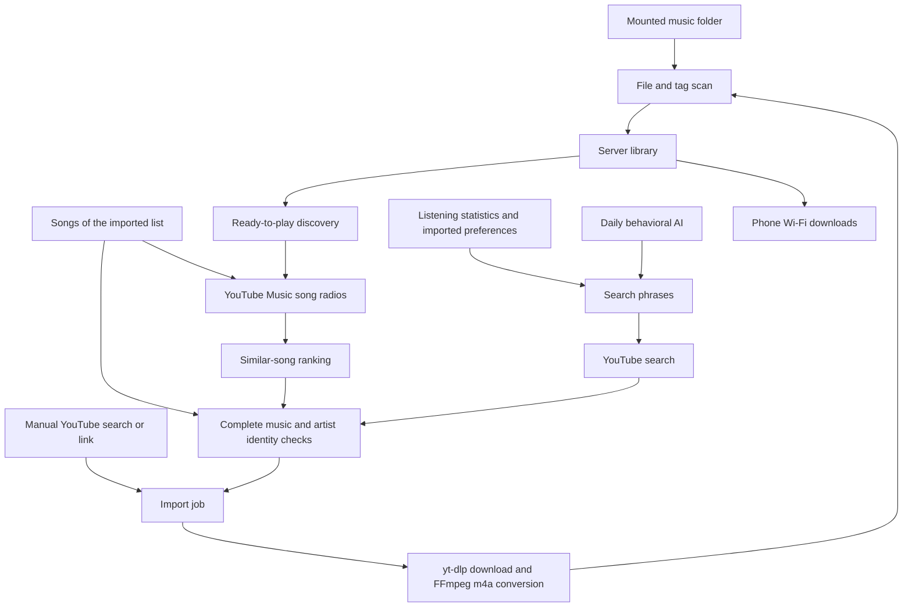

# Music sources, selection and AI

[繁體中文](recommendation-engine.md) · [Configuration](configuration.en.md)

This document describes the implemented behavior. Numbers below are defaults;
the pool settings on an individual server may differ.

## Music sources

Existing music comes from `MUSIC_PATH`. The server rescans supported audio files
about every five minutes, reading titles, artists, albums, duration and artwork.

Music outside the library comes from YouTube/YouTube Music searches, video
links, the songs of the imported list, and YouTube Music's public song radios,
which need no sign-in and are read through
[ytmusicapi](https://github.com/sigma67/ytmusicapi). yt-dlp retrieves audio and
FFmpeg produces m4a files. Echo does not use a YouTube Music account's personal
recommendations or automatically synchronize that account's liked songs.

Without a search query, discovery lists only downloaded, indexed songs. Search
results may require an import before playback.

Source: [scanning, search, import and streaming](../server/app.py),
[discovery pool](../server/radio.py), [similar songs](../server/similar.py).

## Selecting background candidates

The pool targets **60 unheard discovery tracks**. Retained and permanent tracks
do not count toward this target. It allows up to eight pending jobs and three
concurrent downloads. When under target it attempts a refill about every 45
seconds; source failures delay retries.

Pool slots are shared by source: **list songs 25%, similar songs 55%, searches
20%**. Each refill gives a slot to the source furthest below its share. When the
list or similar songs run short, the other song source takes the slot first;
only then does it go to searches.

### List songs

Songs of the imported list that the library does not yet hold (matched by title
and credit) enter the pool directly by their list video ID. Songs whose radio is
available go first; songs YouTube will not play come last, and a failed download
is not retried.

### Similar songs

1. Seeds: every list song (weight 1), plus songs favorited or played at least
   twice in Echo (weight `1 + 3 × favorite + ln(1 + qualifying plays) + 0.25 ×
   min(high-completion plays, 4)`). A single play is not treated as preference.
2. A local file without a video ID is looked up as a YouTube Music song by title
   and artist. A result needs the same title and either a matching credit or a
   length within 8 seconds (YouTube Music often writes artist names in another
   script); otherwise the file is recorded as unmatched.
3. For each seed, the first 50 songs of its YouTube Music song radio are read
   and refreshed every 7 days; the background loop makes at most 8 requests per
   15 seconds.
4. A radio is ignored when its seed is not among its first three songs or when
   more than half of it is promotion slots. A song present in over 40% of the
   fetched radios counts as a promotion slot.
5. Each candidate scores `Σ seed weight / (1 + position in that radio / 5)`:
   songs recommended by more liked songs' radios, and earlier, score higher.
   After removing songs already in the library or the list, candidates are drawn
   from the top 150 with probability weighted by score.

### Searches

Search slots keep the original process:

1. With AI preferences, select two AI search phrases and one exploration phrase.
   Otherwise select three exploration phrases.
2. If imported preferences exist, sample an artist using album-balanced weights
   and replace the first phrase with that artist plus `official audio`.
3. With positive AI artist weights, there is approximately a 25% chance of
   replacing the last phrase with an artist plus `full album official`, allowing
   complete albums and compilations into the pool.
4. Run up to three searches concurrently, each requesting 18 results and cycling
   through the first four pages. Shuffle results, then prioritize Topic channels
   and official-audio markers.
5. Exclude video IDs already present in import jobs. Artist-specific searches
   also check release credits/channel identity to reject wrong-artist matches.

Search phrases retrieve candidates. They do not establish musical genre or
guarantee that results contain complete music.

## Teasers, interviews and other non-song content

Automatic candidates are checked before and after download using source
metadata: teaser, preview, short-version, interview and tutorial markers, live
status, release fields, verified sources, music categories, chapters and track
lists.

List songs are only rejected when live or not yet published. Similar songs that
YouTube Music lists as official audio (ATV) or official music videos (OMV) are
only checked for teaser, short-version and similar format markers. An upload by
a verified channel that credits itself in the title, is categorized as music,
lasts 1–15 minutes and is not karaoke, a cover, a lyric video or a loop also
counts as a song.

Complete albums, medleys, compilations and performances can qualify. Duration
alone is not a rejection rule. Missing valid duration requires verification;
insufficient evidence also blocks automatic admission. Imports retain a 300 MB
file limit.

These are **program rules and metadata checks**, not an AI listening to every
candidate in full. They can misclassify content. Manual imports do not use every
automatic admission threshold. The app's incomplete-music report excludes a
discovery track.

Source: [content checks](../server/content.py).

## Ranking downloaded songs

For You uses a weighted score; AI does not arrange every track individually.

| Component | Score contribution |
| --- | --- |
| Artist affinity | Sum `ln(1 + plays) + 3 × favorite` across that artist's tracks, multiplied by 0.5 |
| Unfamiliarity | Add `3 / (1 + track plays)` |
| Random exploration | Add a random value from 0 up to 1.5 |
| Recent playback | Subtract 4 if played within six hours |
| Discovery pool | Add 2 for an `explore` track; Fresh adds 4 instead |
| Similar songs | Add `4 × √(the track's similarity score ÷ the highest score)`, matched by video ID or by title and credit |
| List songs | Add 2.5 when the track itself is an entry of the imported list |
| Track early skips | Subtract `min(4, 1.5 × intentional early skips of this track)`; disliked tracks are excluded |
| AI artist preference | Add `2 × AI artist weight` |
| Recent early skips | Subtract `min(3, ln(1 + intentional early skips for this artist in 14 days))` |
| Imported preferences | Add `1.5 × album-balanced artist weight` |

Artist names are compared without channel suffixes such as Official, Channel or
Topic, and collaboration credits are split; "Reol Official" counts as Reol.

After sorting, an initial pass admits at most two tracks per artist before
filling the remaining positions. Pull-to-refresh changes the random seed and the
phone keeps a few entries from the preceding list. Further scrolling excludes
already displayed tracks and waits for newly imported content when exhausted.

The former Slow Down/Energy modes did not apply audio-based mood filtering to
ready-to-play songs. They have been replaced by charts and releases.

## Listening history and daily AI

The phone records actual listening time, playback position, completion,
intentional skipping, pause/end and playback errors. Offline events synchronize
later. Event IDs and sequence numbers support deduplication and updates.

- A qualifying play reaches `min(30 seconds, half the track duration)`, or 30
  seconds if duration is unknown.
- High completion requires a completed event and at least 80% of the track's
  duration actually heard.
- An early skip must be intentional, below 30 seconds and below 25% of duration.
  Pauses and playback failures are not early skips.
- A qualifying play, a favorite or a saved mix retains a discovery track; a
  few seconds or an early skip does not. Favorites, manual retention or three
  qualifying plays promote it to the permanent pool.
- **Disliked**: a track skipped early at least twice, and more often than it
  was played through (favorites excepted). It leaves recommendations and
  discovery; discovery or retained pool copies retire and are removed after
  72 hours unless a saved mix uses them; phones drop it from automatic offline
  copies. Original music files are never deleted.

With a configured key and AI enabled, the server analyzes the preceding day
after 04:00 in its configured timezone. It also attempts an initial analysis
when no profile exists. Evidence includes that day, the last 30 days, favorites,
legacy play statistics and imported preferences. Failure preserves the previous
profile and delays retry by at least one hour.

Behavioral evidence removes song titles, lyrics and semantic tags. Artist names
may identify artists and search directions, but cannot establish genre.
Returned observations must cite actual track IDs and pass checks against event
types, counts and listening seconds.

## Actual prompts and output

The complete executed prompts are in
[behavioral analysis, `Gemini.analyze`](../server/gemini.py#L127) and
[audio analysis, `AudioTraits.analyze`](../server/traits.py#L88). `Gemini` is a
historical class name; `.env` determines the actual provider.

The behavioral prompt requires listening evidence, forbids genre inference from
song or artist names, treats one skip as a weak signal, treats imported lists as
broad direction rather than favorites, preserves exploration, and prohibits
treating metadata as instructions.

| Output | Use and validation |
| --- | --- |
| `observations` | Zero to six factual references, each with valid period, track and kind, checked against statistics |
| `artists` | Up to 30 artists weighted from −1 to 1. Positive weights require qualifying evidence; negative weights require at least two intentional early skips. Seed-only weights are capped at 0.45 and at the seed's weight. |
| `queries` | Three to twelve search phrases, at most 150 characters each, with URLs rejected. Used for background discovery. |
| `exploration` | Validated within 0.2–0.5 and stored, but **not currently connected to ranking or search proportions** |

Each request includes its JSON evidence and output schema. The
[transport layer](../server/ai.py#L122) appends a requirement to return only JSON
matching that schema. Gemini uses native Interactions; compatible providers use
Chat Completions. Prompt instructions cannot substitute for listening to audio.

## What audio analysis actually hears

By default, up to 12 tracks are analyzed daily, in batches of at most three.
Selection first balances artists with less analysis coverage, then considers
favorites, play counts and when tracks were added.

Tracks up to 60 seconds are sampled in full. Longer tracks provide three
20-second excerpts around 15%, 48% and 78% of their duration. File tags are
removed and audio is sent under anonymous IDs without titles, artists, albums or
artwork. The model must return audible traits, broad genres, confidence and
supporting timestamps within the sample. Results require confidence of at least
0.8 and valid timestamps; contradictory vocal/instrumental classifications are
rejected.

**Current limits:** routine library audio features mainly support style mixes.
The behavioral AI's `audioSamples` currently come from imported preference audio
samples. These datasets are not yet combined into library-wide recommendation
features. Song similarity comes from co-occurrence in YouTube Music radios, not
from audio embeddings; list songs that cannot be played anonymously have no
radio and cannot be downloaded. Candidates are not listened to in full before
download.

## Rotation, retention and phone downloads

The default daily rotation is 20% of the discovery target: up to 12 for a target
of 60. Eligible tracks are unheard, older than one day, and not accessed in the
last six hours. They are marked retiring and wait 72 hours before cleanup.
Listening, favorites or saved-mix protection can retain them during that period.

Cleanup affects only Echo-managed pool files. Original music and manual imports
are not deleted by rotation. If retained music fills the budget, refilling
pauses rather than deleting retained songs. The default pool budget is 2 GB,
adjustable in Settings. Refilling also pauses below 1 GB of free host storage.

Phone offline storage has a separate budget and selects from recent, frequent,
favorite, recommended and manually retained music. Recommended is on by
default; background syncs switch to each day's recommendations and keep them
for that day to avoid repeated downloads. Disliked tracks are not saved
automatically, although manually retained copies stay. Wi-Fi connections trigger
work, alongside an approximately 15-minute periodic check; Android scheduling
can delay execution. Network traffic and DNS bind to Wi-Fi, with resumable
downloads. Downloaded on the server does not mean saved offline on the phone.

## Charts and new releases

YouTube global/Hong Kong/Taiwan/Japan use the source's weekly Top Songs ranks.
Apple Music Hong Kong/Taiwan/Japan use official most-played RSS ordering. This
implementation has no Apple global feed and does not fabricate one by merging
regional charts.

Echo rankings count qualifying plays over seven days, 30 days or all time, using
listening seconds to break ties. AI does not generate rankings.

Followed artists are stored by Apple artist ID and region, up to 50 entries.
Each lookup requests up to 200 recent songs. Releases sort by the catalog's
`releaseDate`, excluding future dates. Reissues can carry newer dates; these are
catalog dates, not YouTube upload dates.

Charts and followed catalogs refresh approximately every six hours. Source
failures retain the last successful data with a status indication.
Pull-to-refresh has a minimum request interval. External entries provide chart
or catalog metadata: unambiguous library matches play directly; YouTube entries
can be imported; Apple entries can search for YouTube audio. Apple preview clips
are not presented as complete songs.

YouTube Charts uses the official site's public data interface, not a versioned
API with compatibility guarantees. Site changes may require parser updates.
YouTube uses `YOUTUBE_PROXY_URL`; Apple catalogs use direct server connections.
These sources require no AI API key.

Sources: [YouTube Charts](https://charts.youtube.com/),
[Apple RSS](https://rss.marketingtools.apple.com/),
[Apple lookup documentation](https://developer.apple.com/library/archive/documentation/AudioVideo/Conceptual/iTuneSearchAPI/LookupExamples.html).
Implementation: [charts and artist catalogs](../server/charts.py).

## Sleep timer

After 15, 30, 45, 60 or 90 minutes, the phone's playback service pauses playback
and clears the timer. It is intended to stop bedtime listening automatically.
It does not detect sleep, change recommendations, delete songs or stop server
imports. Volume fade-out and stopping at the end of the current track are not
implemented.
