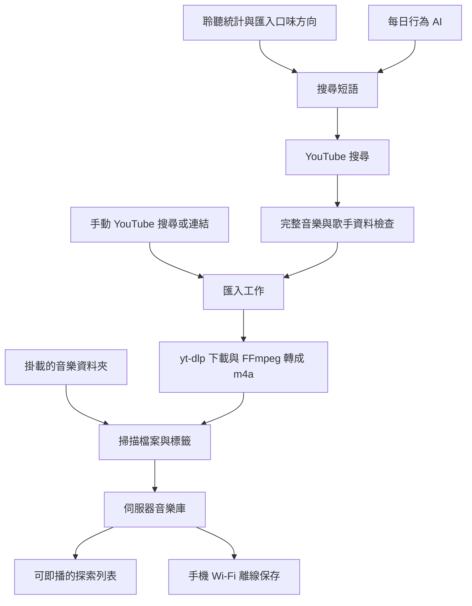

# 音樂來源、選歌與 AI

[English](recommendation-engine.en.md) · [設定指南](configuration.md)

本文件說明程式實際使用的流程。下列數字為程式預設，伺服器上的新歌池設定可能不同。

## 音樂從哪裡來

原有音樂來自 `MUSIC_PATH`。伺服器約每 5 分鐘重新掃描支援的音訊檔，讀取歌名、歌手、專輯、長度與封面。

庫外音樂來自 YouTube／YouTube Music 的搜尋結果或影片連結，使用 yt-dlp 取得音訊，FFmpeg 轉成 m4a。沒有使用 YouTube Music 帳戶的個人推薦 API，也不會自動同步該帳戶的最愛。

探索列表在沒有搜尋詞時，只列出已完成下載及入庫的歌曲。輸入搜尋詞後，顯示的 YouTube 結果可能尚未下載；它們需要匯入後才能播放。

原始碼：[掃描、搜尋、匯入與串流](../server/app.py)、[新歌池](../server/radio.py)。

## 背景怎樣選候選歌曲

新歌池預設維持 **60 首未聽探索歌曲**，已保留與常駐歌曲不計入這 60 首。每次補充最多維持 8 個待處理工作，下載同時最多 3 個。缺歌時約每 45 秒嘗試補充；來源出錯會延後重試。

候選搜尋流程：

1. 有 AI 偏好時，隨機取 2 個 AI 搜尋短語，加 1 個探索短語；沒有 AI 偏好時取 3 個探索短語。
2. 有匯入口味清單時，按專輯平衡後的歌手權重抽取一位，將第一個短語換成該歌手加 `official audio`。
3. 有正向 AI 歌手權重時，約 25% 機率將最後一個短語換成該歌手的 `full album official`，讓完整專輯與合集有機會入池。
4. 同時執行最多 3 個 YouTube 搜尋，每個取 18 筆，輪流使用前 4 頁。先打亂，再優先排列 Topic 頻道及帶有官方音源標記的結果。
5. 以影片 ID 排除已有匯入工作。指定歌手的搜尋還會核對發行署名／頻道身份，避免把同名或錯誤歌手當成候選。

搜尋短語是找候選的方法，並不能證明歌曲的曲風，也不能保證搜尋結果一定是完整音樂。

## 怎樣排除 teaser、訪談或其他非歌曲

自動候選在下載前及下載後都會檢查來源資料：預告／試聽／短版／訪談／教學標記、直播狀態、發行欄位、認證來源、音樂分類、章節與曲目表。

完整專輯、串燒、合集與演出可被接受；不以「太長」或「太短」直接判定不是歌曲。缺少有效時長會列為待核實。資料不足的條目也不會自動放進探索池。單次匯入仍有 300 MB 檔案限制。

這是**程式規則與來源資料檢查**，不是由 AI 聽完所有候選後判定。規則可能誤判；手動匯入也沒有套用全部自動入池門檻。App 的「不是完整音樂」回報會排除該探索歌曲。

原始碼：[完整音樂檢查](../server/content.py)。

## 已入庫歌曲怎樣排序

「為你」使用明確的加權分數，而不是由 AI 逐首決定順序：

| 項目 | 對分數的影響 |
| --- | --- |
| 同歌手偏好 | 該歌手所有歌曲的 `ln(1 + 播放次數) + 3 × 最愛標記` 加總，再乘 0.5 |
| 尚未聽熟 | 加 `3 / (1 + 該曲播放次數)` |
| 隨機探索 | 加 0 至 5 之間的隨機值 |
| 最近播過 | 最近 6 小時播過減 4 |
| 新歌探索池 | `explore` 歌曲加 5；「新鮮感」改為加 10 |
| AI 歌手權重 | 加 `2 × AI 歌手權重` |
| 近期早跳 | 減 `min(3, ln(1 + 近 14 天該歌手的主動早跳次數))` |
| 匯入口味方向 | 加 `1.5 × 經專輯平衡的歌手權重` |

排序後先讓每位歌手最多出現 2 首，再補足數量，減少單一歌手佔滿前排。下拉重新整理會換隨機種子，並由手機保留少量前一列表的歌曲；持續下滑排除已顯示的歌曲，等待新入庫內容補入。

舊有「慢下來／提提神」沒有對可即播列表使用音訊情境篩選，不能視為有效的情緒分類；介面已以榜單及新發行取代。

## 聆聽記錄與每日 AI

手機記錄實際播放時間、曲目位置、完成、主動跳過、暫停／結束及播放錯誤，離線記錄稍後同步。每個播放事件有 ID 與序號，用於去重與更新。

- 有效播放：聽到 `min(30 秒, 歌曲長度的一半)`；缺少長度時用 30 秒。
- 高完成度：事件為完成，且實際聆聽秒數達整首 80%。
- 主動早跳：使用者主動跳過，且未滿 30 秒、未達整首 25%。暫停與播放失敗不是早跳。
- 已聽任意正秒數的探索歌曲會保留；最愛、手動常駐，或有效播放達預設 3 次會進常駐池。

有設定 key 且開啟 AI 時，伺服器在所設時區每日 04:00 後分析前一天；首次沒有偏好資料時也會嘗試分析。資料包括當天、近 30 天、最愛、舊版播放統計及匯入口味清單。失敗保留舊偏好，至少延後一小時重試。

AI 收到的行為資料會移除歌名、歌詞與標籤語意。歌手名稱可以用於身份與搜尋方向，但不能作為曲風證據。回傳的觀察需引用實際曲目 ID，並通過次數、秒數與事件類型核對。

## AI 提示詞與回傳格式

完整、實際執行的提示詞見 [行為提示詞 `Gemini.analyze`](../server/gemini.py#L127) 與 [音訊提示詞 `AudioTraits.analyze`](../server/traits.py#L88)。類別名稱 `Gemini` 是歷史名稱，實際渠道由 `.env` 選擇。

行為提示詞要求：只依聆聽證據、不能從歌名或歌手名猜曲風；單次跳過只作弱訊號；匯入清單是大方向，不等同最愛；保留探索；禁止將中繼資料當成指令。

| AI 回傳欄位 | 用途與驗證 |
| --- | --- |
| `observations` | 0–6 條事實引用；每條須有正確的 period、track、kind，並符合實際統計。 |
| `artists` | 最多 30 位歌手，權重 −1 至 1。正向權重需有效播放／最愛等依據；負向權重需至少 2 次主動早跳。僅來自清單的權重上限為 0.45 且不超過清單權重。 |
| `queries` | 3–12 個搜尋短語，每個最多 150 字元，不接受 URL。用於背景找歌。 |
| `exploration` | 0.2–0.5；**目前只驗證並儲存，沒有接入排序或搜尋比例。** |

每次請求另附當次 JSON 證據與輸出 schema；[傳輸層](../server/ai.py#L122)追加要求只回傳符合 schema 的 JSON。Gemini 使用原生 Interactions；相容渠道使用 Chat Completions。提示詞不是可以省略實際音訊的替代品。

## 音訊分析實際聽了什麼

預設每天最多分析 12 首，每次最多 3 首。優先補足較少分析的歌手，再參考最愛、播放次數及入庫時間。

60 秒內的歌曲抽取整段；較長歌曲取約 15%、48%、78% 處各 20 秒。移除檔案標籤，使用匿名 ID 傳送音訊；不附歌名、歌手、專輯或封面。模型須回傳可聽見的特徵、廣義曲風、信心值及片段內的支持時間點。只保留信心至少 0.8 且時間點有效的結果；矛盾的人聲／純音樂分類會被拒絕。

**目前的限制：** 日常庫內音訊結果主要供曲風歌單使用；行為 AI 的 `audioSamples` 目前來自已匯入的口味樣本音訊資料。兩者尚未合併成涵蓋整個音樂庫的推薦特徵。程式沒有建立音訊 embedding／歌曲相似度索引，也沒有在下載前聽完整首候選音樂。

## 輪換、保存與手機下載

伺服器預設每日輪換探索目標的 20%，60 首目標即最多 12 首。只選入池超過一天、未聽、最近 6 小時未被存取的探索歌曲，先標記退役，再等 72 小時才清理。期間若收到聆聽、最愛或已保存歌單的保護，則保留。

只會清理 Echo 管理的探索檔案。原有音樂與手動匯入檔案不受池輪換刪除。已保留內容佔滿容量時停止補新歌，不強行刪除保留歌曲。程式預設探索池容量 2 GB，可在設定修改；主機剩餘空間不足 1 GB 時暫停補充。

手機離線保存是另一套容量管理：按最近、常聽、最愛、推薦與手動保留組合，受手機容量上限約束。Wi-Fi 連線會觸發工作，亦有約 15 分鐘週期檢查，但執行時間受 Android 背景排程影響。網路與 DNS 綁定 Wi-Fi，支援中斷續傳。伺服器已下載不等於手機已離線保存。

## 榜單與新發行

YouTube 全球／香港／台灣／日本採用來源的每週熱門歌曲排名；Apple Music 香港／台灣／日本採用官方熱門歌曲 RSS 順序。Apple RSS 沒有在此實作中提供全球榜，不以合併地區榜代替。

Echo 播放排行由有效播放記錄計算，支援近 7 天、近 30 天與所有時間；次數相同時比較聆聽秒數。排名不由 AI 生成。

關注歌手以 Apple 目錄的歌手 ID 與地區保存，最多 50 位。每位查詢最多 200 首最近歌曲，按目錄 `releaseDate` 由新到舊排列，排除未發行日期；這是來源提供的發行日期，重發版本也可能有較新的日期，不是 YouTube 上傳時間。

榜單與關注目錄約每 6 小時檢查更新；來源失敗保留舊資料並標示狀態。下拉刷新有最短間隔，避免重複請求。外部條目只提供排名／目錄資料：庫內已有且身份明確者直接播放；YouTube 條目可匯入；Apple 條目可搜尋 YouTube 音源，不使用 Apple 預覽片段冒充完整歌曲。

YouTube 榜單使用官方網站的公開資料介面，並非有相容性保證的正式 API；網站改版時可能需要更新解析程式。YouTube 連線沿用 `YOUTUBE_PROXY_URL`；Apple 目錄使用伺服器直接連線。這些資料來源不需要 AI API key。

來源：[YouTube Charts](https://charts.youtube.com/)、[Apple RSS](https://rss.marketingtools.apple.com/)、[Apple 歌手查詢文件](https://developer.apple.com/library/archive/documentation/AudioVideo/Conceptual/iTuneSearchAPI/LookupExamples.html)。原始碼：[榜單與關注目錄](../server/charts.py)。

## 睡眠定時

設定 15、30、45、60 或 90 分鐘後，由手機播放服務暫停音樂並清除定時。用途是睡前播放時自動停止。它不是睡眠偵測，不會改動推薦、刪除歌曲或停止伺服器取歌；目前沒有漸弱音量或播完本首再停的模式。
